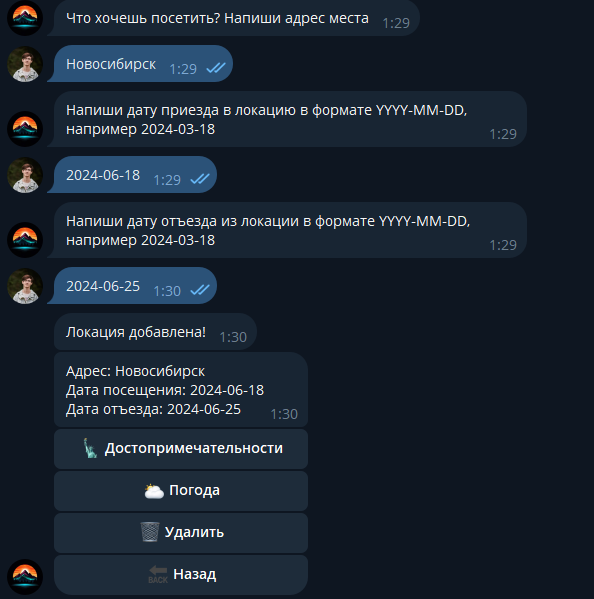
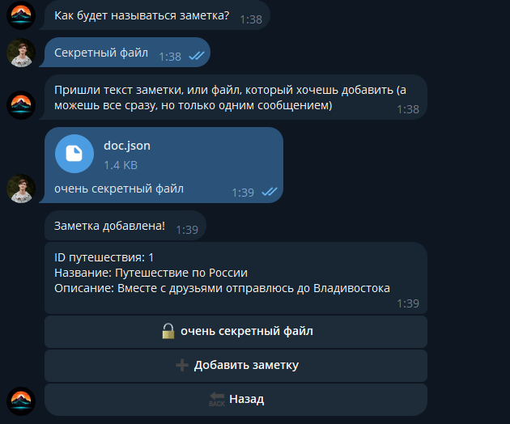
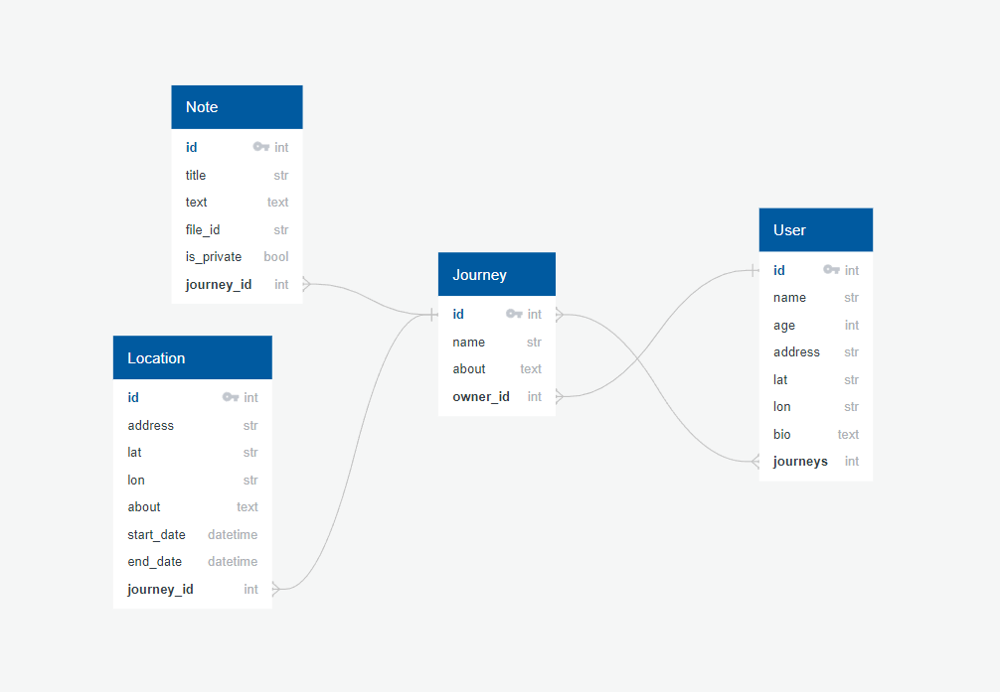

# Wanderlust
## _Ваш проводник в мир незабываемых путешествий!_

## Сслыка: [@wanderlusterbot](https://t.me/wanderlusterbot)

## Описание

#### 1. Регистрация
При первом заходе в бота пользователю предлагается зарегестироваться и ввести необходимые данные(есть валидация). После этого он может посмтореть/отредактировать свой профиль

#### 2. Путешествия
Пользователь может создать путешествие, указав необходимые параметры, после чего он может начинать планировать свой маршрут, добавлять новых участников и тд


#### 3. Локации
Пользователь создает локацию, после чего может узнать погоду в ней и посмотреть достопримечательности



#### 4. Участники путешествия
Создатель путешествия может добавить в него участников, после чего они могут просматривать все(кроме приватных заметок), что связано с путешествием(но не изменять его!)

#### 5. Заметки
Создатель путешествия может создавать заметки и делать их приватными/открытыми для других участников путешествия



## Внешние интеграции
1. [geosuggest](https://yandex.ru/dev/geosuggest/doc/ru/) - Используется для проверки на то, существует ли место, которое ввел пользователь, а также для исправления ошибок в названии геолокации. Хоть это и не open source, это лучшее решение для запросов на русском языке, так как ориентирован именно на него, а бот разрабатывался с упором на русскоязычную аудиторию. 1000 бесплатных запросов в сутки

2. [geocoder](https://yandex.ru/dev/geocode/doc/ru/) - Используется для получения координат локации, по ее названию. Идеально работает в связке с geosuggest. 1000 бесплатных запросов в сутки

3. [openweathermap](https://openweathermap.org/api) - Используется для получения данных о погоде. Одно из лучших решений на рынке. 1000 бесплатных запросов в сутки

4. [opentripmap](https://dev.opentripmap.org/ru/product) - Используется для получения данных о достопримечательностях места, по его координатам. Ориентирован на русскоговорящую аудиторию. Open source инструмент, 5000 запросов в сутки

5. [graphhopper](https://graphhopper.com/maps/) - Простая и быстрая отрисовка маршрута путешествия, с возможностью выбирать вид транспорта. Open source инструмент, базируется на Open street map
---
## Внутренние зависимости
1. [aiogram](https://docs.aiogram.dev/en/latest/) - основной фреймфорк, для разработки бота, считается одним из лучших, благодаря асинхронности и простоте разработки
2. [sqlite](https://www.sqlite.org/docs.html) - база данных, которая идеально подходит для разработки небольших проектов.Имеет высокую производительность, отсутствует необходимость в администрировании
3. [peewee](https://docs.peewee-orm.com/en/latest/) - лёгкая, гибкая и очень быстрая ORM
## Варианты запуска
### 1. Docker
```bash
git clone https://github.com/Central-University-IT-prod/backend-DRAKUTONT.git

cd backend-DRAKUTONT

docker-compose up
```
### 2. Обычная установка
```bash
git clone https://github.com/Central-University-IT-prod/backend-DRAKUTONT.git

cd backend-DRAKUTONT

pip install -r requirements.txt

python main.py
```
#### Файл конфигурации
Скопируйте файл `.env.template`, переименуйте его в `.env` и подставьте необходимые значения

```bash
BOT_TOKEN=
SUGGEST_API_KEY=
GEOCODER_API_KEY=
OPENWEATHER_API_KEY=
OPENTRIPMAP_API_KEY=
```
## Схема СУБД

